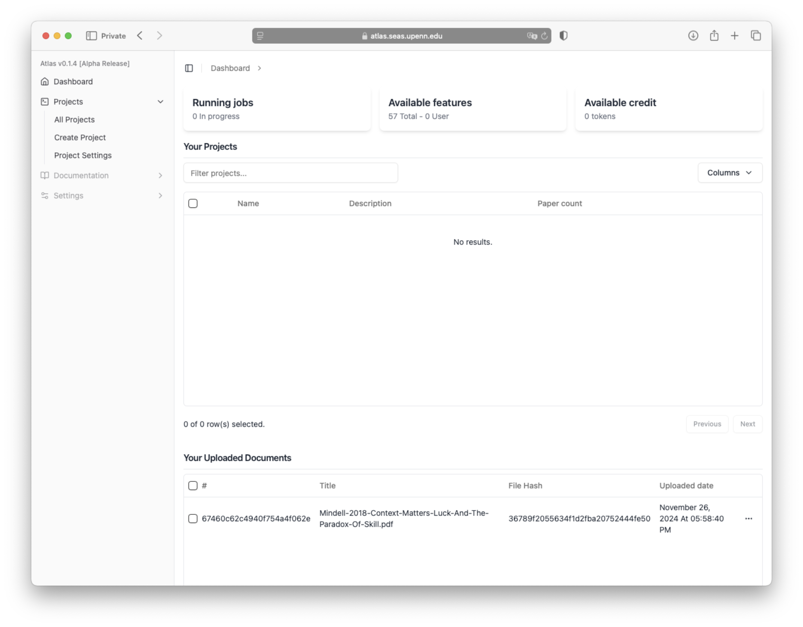

# Introduction to Atlas

Welcome to Atlas! This documentation will guide you through the features and functionalities of the Atlas platform.

Atlas is designed to help you manage your projects efficiently and effectively. Explore the various sections to learn more about what Atlas can do for you.

## Getting Started

After logging in, you will be directed to the dashboard. The dashboard provides an overview of your projects and tasks. You can create new projects, view existing projects, and manage your tasks from the dashboard.

You will be able to get a quick glance at your running project tasks, available research cartography "features" and your project's overall progress.

There are three concepts that you need to understand to get started with Atlas:

1. **Projects**: A project is a collection of papers/articles that you are working on. You can create a new project, view existing projects, and manage your project tasks from the dashboard. Each project can have multiple arcticles and features associated with it.

2. **Tasks**: A task is a unit of analysis that you can perform on a paper/article. After uploading a paper, the platform will automatically generate your selected features on the project on the paper. You can view the generated features and edit them as needed.

3. **Features**: Features are the extracted information from the paper. You can view the features generated on a paper and edit them as needed. The platform provides a set of features that you can use to analyze the paper. You can also create custom features to analyze the paper. Features can be nested under other features to create a hierarchy of features. 

